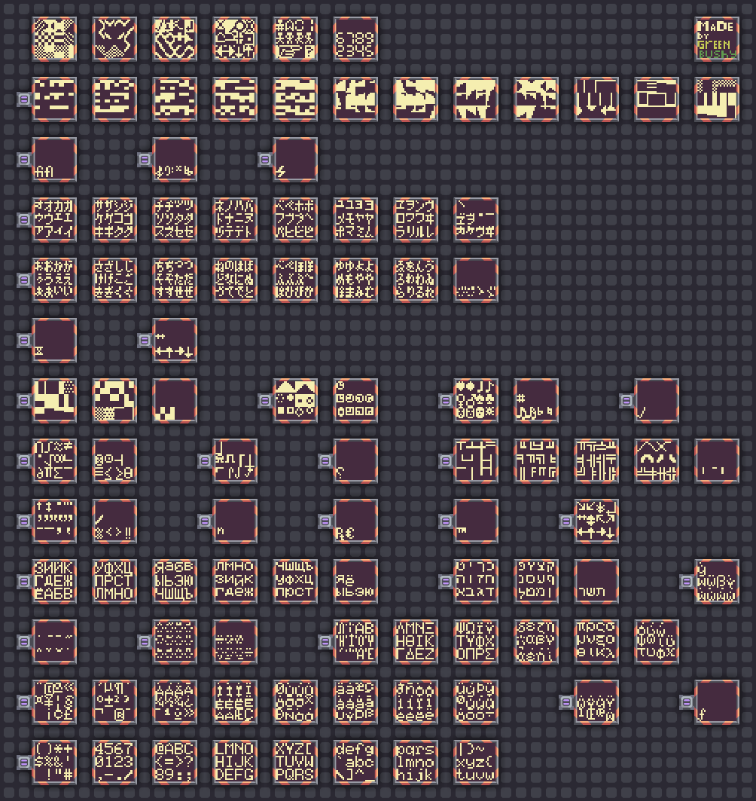

# fonts-for-schemes-in-mindustry
This repository is needed to store fonts for creating schemes in mindustry
You can just take them from here and use them.

[Large-Canvas-Font-8x8-bold](large-canvas-font-8x8-bold.msch)

---

[Large-Canvas-Font-6x8-HP100-LX](large-canvas-font-6x8-hp100-lx.msch)

The font is taken from this repository: https://codeberg.org/Dmian/font-lexis

